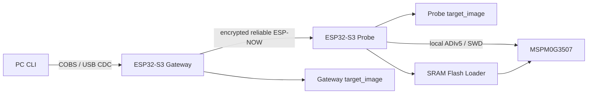

# Architecture

## Data and control path



The role is selected by Kconfig at compile time. USB presence is never used to
guess a role. Wi-Fi/radio receive runs on Core 0; the ESP-NOW TX worker and SWD
programmer task are pinned to Core 1. ESP-NOW callbacks only copy fixed-size
records into queues. Gateway and Probe application workers are separate from
the radio RX task, so USB, storage and SWD work cannot block frame reception.

## Components

| Component | Ownership |
|---|---|
| `common` | status codes, monotonic time, CRC16, CRC32C, PSA SHA-256 |
| `protocol` | explicit little-endian USB/wire/manifest/progress encoding, COBS |
| `security` | fixed MAC validation, PMK/LMK access, peer whitelist |
| `storage` | image and metadata partitions, sequential staging, SHA validation |
| `transport_espnow` | peer setup, committed ACKs, async RX tokens, retry, epoch recovery |
| `gateway_usb` | TinyUSB CDC receive queue, frame decoder and serialized transmit |
| `gateway_app` | PC commands, Gateway staging, image forwarding, event aggregation |
| `swd_phy` | VTref gate, GPIO timing, request/ACK/parity and safe state |
| `arm_adi` | SW-DP, DP/AP selection, MEM-AP reads/writes and posted reads |
| `cortexm_debug` | DHCSR/DCRSR/DCRDR/AIRCR halt, registers, run and reset |
| `mspm0g3507` | MAIN/SRAM layout, CPUID/Factory Region checks, SRAM self-test |
| `mspm0_loader` | upload, mailbox command execution and result validation |
| `programmer` | Core-1 erase/program/readback/reset state machine |
| `probe_app` | queued application worker, serialized SWD/storage work and status responses |
| `diagnostics` | UART identity/capacity logs and activity LED |

## Programmer phases

```text
IDLE -> CONNECT -> IDENTIFY -> LOADER -> ERASE -> PROGRAM -> VERIFY -> RESET -> DONE
                                      \---------------- failure/abort ----------> safe halt
```

`PROGRAM_START` is keyed by a non-zero operation ID. Repeating the same active
or completed operation does not start another erase. A different operation is
rejected while programming is active.

The Loader code occupies `0x20200000..0x20201FFF`, mailbox starts at
`0x20202000`, the 1 KiB data buffer at `0x20202400`, and initial MSP is
`0x20208000`. Its build checks code size and entry address before generating the
ESP32 C blob.
